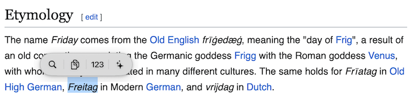
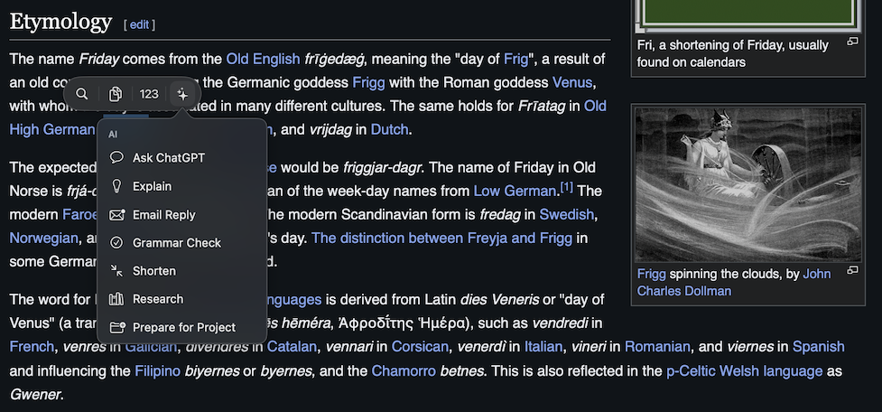

# ClipBar 1.4 “Frija”

A customizable action bar for selected text on macOS.

ClipBar displays a compact action bar after text selection and provides context-aware actions for search, copying, URLs, email addresses, local paths, AI workflows and extensible JSON plugins.

 

## Features

- native macOS menu-bar utility
- context-aware actions and plugin groups
- application blacklist
- Light Mode, Dark Mode, Reduce Motion, and Reduce Transparency support
- diagnostic logging for selection, panel, and clipboard troubleshooting

## Configuration

ClipBar keeps user-editable files in:

```text
~/.config/clipbar/
├── settings.json
├── blacklist.txt
├── plugins/
├── logs/
└── cache/
```

The blacklist reloads automatically after saving. Use **Blacklist → Current Apps** to copy a running application's bundle identifier.

## Requirements

- macOS 13 or later
- Apple Silicon Mac
- Swift compiler / Xcode Command Line Tools

## Build

```zsh
xattr -cr "/Path/clipbar"
cd /Path/clipbar
./build.zsh
```

## Privacy

ClipBar is designed with privacy as a core principle.

- All text processing happens locally on your Mac.
- Selected text is never sent anywhere unless you explicitly choose an action that opens an external service (for example, a web search or an AI plugin).
- ClipBar does not collect analytics, telemetry, usage statistics, or personal data.
- The app does not communicate with any server of its own.
- Configuration files and logs are stored locally in `~/.config/clipbar/`.
- Crash recovery, when enabled, uses macOS LaunchAgents and does not transmit any information.

External plugins and websites may have their own privacy policies.

The built-in Thesaurus works offline. German synonym data is provided by
[OpenThesaurus](https://www.openthesaurus.de/) under the GNU LGPL 2.1 or later;
English synonym data is derived from Princeton WordNet 3.0. The corresponding
license texts are included in the application bundle.

## Author

Created by [Steffen Wöll](https://steffenwoell.github.io), 2026.

## License

MIT License.
